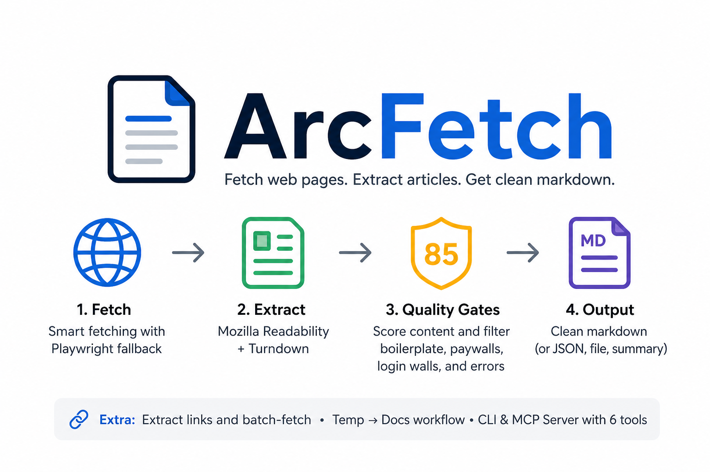
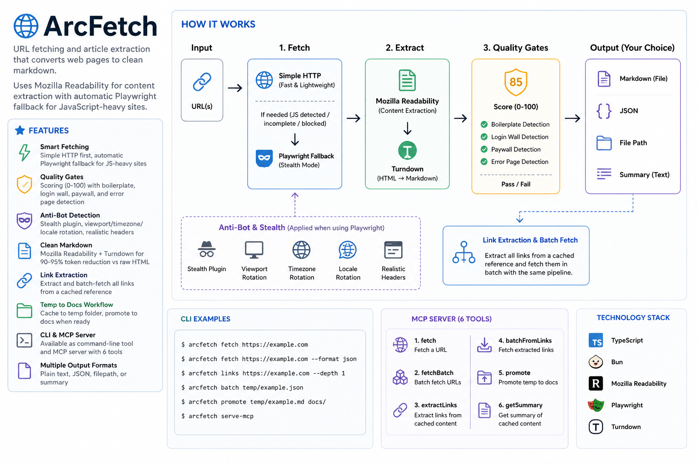

<p align="center">
  
</p>

# arcfetch

[](https://www.npmjs.org/package/arcfetch)
[](https://opensource.org/licenses/MIT)

**Zero-config URL fetching** that converts web pages to clean markdown with automatic JavaScript rendering fallback.

Perfect for AI workflows, research, and documentation. Fetches URLs, extracts article content using Mozilla Readability, and caches as markdown with 90-95% token reduction.

## Why arcfetch?

| Problem | Solution |
|---------|----------|
| **JS-heavy sites return blank** | Auto-detects and retries with Playwright |
| **Login walls / error pages scored as content** | Boilerplate detection (22 patterns) catches them |
| **Too much HTML clutter** | Mozilla Readability extracts just the article |
| **High token costs for LLMs** | 90-95% token reduction vs raw HTML |
| **No good caching story** | Temp → Docs workflow for easy curation |
| **Hard to integrate** | Works as CLI or MCP server with zero setup |

## Features

- **Smart Fetching**: Simple HTTP first, automatic Playwright fallback for JS-heavy sites
- **Quality Gates**: Scoring (0-100) with boilerplate, login wall, paywall, and error page detection
- **Content-to-Source Ratio**: Catches JS-rendered or gated content by comparing extracted text to source HTML size
- **Anti-Bot Detection**: Stealth plugin, viewport/timezone/locale rotation, realistic headers, navigator overrides
- **Clean Markdown**: Mozilla Readability + Turndown for 90-95% token reduction
- **Temp → Docs Workflow**: Cache to temp folder, promote to docs when ready
- **Link Extraction**: Extract and batch-fetch all links from a cached reference
- **CLI & MCP**: Available as command-line tool and MCP server (6 tools)
- **Multiple Output Formats**: Plain text, JSON, filepath, or summary

## Quick Start

### No Installation Required

```bash
# Fetch and display markdown
bunx arcfetch fetch https://example.com/article

# Get just the filepath (for scripts)
bunx arcfetch fetch https://example.com -o path

# With pretty output
bunx arcfetch fetch https://example.com --pretty
```

arcfetch is a Bun-based executable. `npx arcfetch` also works when `bun` is installed on `PATH`.

### Global Installation

```bash
bun add --global arcfetch

# Then use directly
arcfetch fetch https://example.com/article
```

### Development

```bash
git clone https://github.com/briansunter/arcfetch.git
cd arcfetch
bun install
bun run cli.ts fetch https://example.com
```

## CLI Usage

### Commands

```bash
# Fetch a URL and save to temp folder
arcfetch fetch https://example.com/article

# List all cached references
arcfetch list

# Extract links from a cached reference
arcfetch links my-article

# Fetch all links from a cached reference (parallel)
arcfetch fetch-links my-article

# Promote from temp to permanent docs
arcfetch promote my-article

# Delete a cached reference
arcfetch delete my-article

# Show current configuration
arcfetch config

# Start MCP server
arcfetch mcp
```

### Output Formats

```bash
# Plain text (LLM-friendly, default)
arcfetch fetch https://example.com -o text

# Just the filepath (for scripts)
arcfetch fetch https://example.com -o path

# Summary: slug|filepath
arcfetch fetch https://example.com -o summary

# Structured JSON
arcfetch fetch https://example.com -o json

# Human-friendly with emojis
arcfetch fetch https://example.com --pretty
```

### Advanced Options

```bash
# Add search query as metadata
arcfetch fetch https://example.com -q "machine learning"

# Set minimum quality threshold (default: 60)
arcfetch fetch https://example.com --min-quality 80

# Force Playwright (skip simple fetch)
arcfetch fetch https://example.com --force-playwright

# Use faster wait strategy for simple sites
arcfetch fetch https://example.com --wait-strategy load

# Re-fetch even if URL already cached
arcfetch fetch https://example.com --refetch

# Custom directories
arcfetch fetch https://example.com --temp-dir .cache --docs-dir content

# Verbose output for debugging
arcfetch fetch https://example.com -v
```

## MCP Server

### Installation (Recommended: bunx)

Add to your Claude Code MCP configuration:

```json
{
  "mcpServers": {
    "arcfetch": {
      "command": "bunx",
      "args": ["arcfetch"]
    }
  }
}
```

Or using `npx` when `bun` is installed on `PATH`:

```json
{
  "mcpServers": {
    "arcfetch": {
      "command": "npx",
      "args": ["arcfetch"]
    }
  }
}
```

### Local Development

```json
{
  "mcpServers": {
    "arcfetch": {
      "command": "bun",
      "args": ["run", "/path/to/arcfetch/index.ts"],
      "cwd": "/path/to/arcfetch"
    }
  }
}
```

### MCP Tools

| Tool | Parameters | Description |
|------|------------|-------------|
| `fetch_url` | `url`, `query?`, `minQuality?`, `refetch?`, `outputFormat?` | Fetch URL with auto JS fallback |
| `list_cached` | `tempDir?` | List all cached references |
| `promote_reference` | `refId`, `tempDir?`, `docsDir?` | Move from temp to docs folder |
| `delete_cached` | `refId`, `tempDir?` | Delete a cached reference |
| `extract_links` | `refId`, `tempDir?`, `outputFormat?` | Extract links from a cached reference |
| `fetch_links` | `refId`, `tempDir?`, `docsDir?`, `refetch?`, `outputFormat?` | Fetch all links from a cached reference |

## Configuration

### Config File

Create `arcfetch.config.json` in your project root:

```json
{
  "quality": {
    "minScore": 60,
    "jsRetryThreshold": 85
  },
  "paths": {
    "tempDir": ".tmp/arcfetch",
    "docsDir": "docs/ai/references"
  },
  "playwright": {
    "timeout": 30000,
    "waitStrategy": "networkidle"
  }
}
```

Config files checked (in order): `arcfetch.config.json`, `.arcfetchrc`, `.arcfetchrc.json`

### Environment Variables

```bash
ARCFETCH_MIN_SCORE=60
ARCFETCH_JS_RETRY_THRESHOLD=85
ARCFETCH_TEMP_DIR=.tmp/arcfetch
ARCFETCH_DOCS_DIR=docs/ai/references
```

Legacy `SOFETCH_*` names are still supported for existing setups.

### Priority Order

CLI arguments > Environment variables > Config file > Built-in defaults

## How It Works



The pipeline runs four stages in order — fetch, extract, quality-gate, output — with a Playwright fallback when simple HTTP returns blank or low-quality content.

### Quality Scoring

Score starts at 100, deductions apply:

| Check | Deduction |
|-------|-----------|
| Blank content | Score = 0 |
| Content < 50 chars | -50 |
| Content < 300 chars | -15 |
| HTML tags > 100 | -40 |
| HTML tags > 50 | -20 |
| HTML ratio > 30% | -25 |
| Extraction ratio < 0.5% (large page) | -35 |
| Extraction ratio < 2% (large page) | -20 |
| Boilerplate detected | -40 |
| Script/style tags | -10 to -15 |

### Boilerplate Detection

On short content (< 2000 chars), 22 patterns are checked:

- **Error pages**: "something went wrong", "an error occurred"
- **404 pages**: "page not found"
- **Login walls**: "log in to continue", "please log in", "sign in to continue"
- **Paywalls**: "subscribe to continue reading"
- **Bot detection**: "are you a robot", "complete the captcha"
- **Access denied**, **JS-required**, **unsupported browser**

Long articles (>= 2000 chars) are not checked for boilerplate to avoid false positives.

### Playwright Wait Strategies

| Strategy | Speed | Reliability | Best For |
|----------|-------|-------------|----------|
| `networkidle` | Slowest | Highest | JS-heavy apps, dynamic content |
| `domcontentloaded` | Medium | Medium | Most SPAs, modern sites |
| `load` | Fastest | Basic | Static sites, simple pages |

## File Format

Cached files use markdown with YAML frontmatter:

```markdown
---
title: "Article Title"
source_url: "https://example.com/article"
fetched_date: 2026-02-06
type: web
status: temporary
query: "optional search query"
---

# Article Title

Extracted markdown content...
```

- **Ref IDs** are slugified titles (e.g., `how-to-build-react-apps`)
- **Temp storage**: `.tmp/arcfetch/<slug>.md` (status: temporary)
- **Permanent storage**: `docs/ai/references/<slug>.md` (status: permanent, after promote)
- **Duplicate detection**: re-fetching same URL returns existing ref unless `--refetch`

## Real-World Examples

### AI Research Workflow

```bash
# Fetch multiple articles for research
arcfetch fetch https://arxiv.org/abs/2301.00001 -q "LLM research"
arcfetch fetch https://openai.com/research/gpt-4 -q "GPT-4"

# Review all cached references
arcfetch list --pretty

# Promote the good ones to docs
arcfetch promote llm-research-paper
arcfetch promote gpt-4-technical-report
```

### Link Crawling Workflow

```bash
# Fetch a page with lots of links
arcfetch fetch https://example.com/resources --pretty

# See what links it contains
arcfetch links resources --pretty

# Fetch all of them in parallel
arcfetch fetch-links resources --pretty
```

### Script Integration

```bash
#!/bin/bash
# Fetch and get filepath
filepath=$(arcfetch fetch https://example.com -o path)

# Process with other tools
cat "$filepath" | other-tool

# Or get JSON for structured processing
arcfetch fetch https://example.com -o json | jq '.quality'
```

### Handling JS-Heavy Sites

```bash
# Modern React/Vue/Angular apps
arcfetch fetch https://spa-example.com --force-playwright

# Simple blogs (use faster strategy)
arcfetch fetch https://blog.example.com --wait-strategy load

# Unknown site (let arcfetch decide automatically)
arcfetch fetch https://unknown-site.com -v
```

## Troubleshooting

### Low Quality Score

```bash
# Lower the threshold temporarily
arcfetch fetch https://example.com --min-quality 40

# Or force Playwright (often produces better results)
arcfetch fetch https://example.com --force-playwright

# Check what's happening with verbose mode
arcfetch fetch https://example.com -v
```

### Timeout on Slow Sites

```bash
# Use faster wait strategy
arcfetch fetch https://example.com --wait-strategy load

# Combine with force-playwright for JS sites
arcfetch fetch https://example.com --force-playwright --wait-strategy domcontentloaded
```

## Architecture

```
┌──────────────────────────────────────────────────────┐
│                  CLI / MCP Interface                  │
└──────────────────────────────────────────────────────┘
                           │
                           ▼
┌──────────────────────────────────────────────────────┐
│                   Core Pipeline                       │
│  1. Simple HTTP Fetch (browser-like UA)               │
│  2. Extract with Readability + Turndown               │
│  3. Quality Score + Boilerplate Detection             │
│  4. Conditional Playwright Retry (with stealth)       │
│  5. Cache with YAML Frontmatter                       │
└──────────────────────────────────────────────────────┘
                           │
           ┌───────────────┼───────────────┐
           ▼               ▼               ▼
     ┌───────────┐  ┌───────────┐  ┌───────────┐
     │   Cache   │  │ Playwright│  │ Quality   │
     │  Manager  │  │  Manager  │  │ Validator │
     └───────────┘  └───────────┘  └───────────┘
```

## Contributing

```bash
git clone https://github.com/briansunter/arcfetch.git
cd arcfetch
bun install
bun test          # Run tests
bun run typecheck # Type checking
bun run check     # Lint + format check
```

## License

MIT License - see LICENSE file for details
